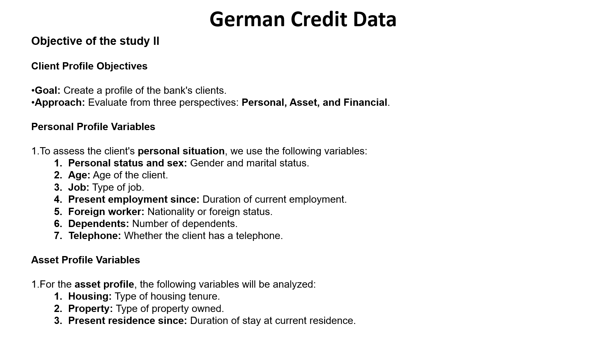

# **German Credit Data (UCI)**

This repository is an evolution of a practical assignment for the Data Mining course in the Data Science Master’s program at the Open University of Catalonia (UOC)

**http://archive.ics.uci.edu/dataset/144/statlog+german+credit+data**

#Project Includes:
* credit.zip ----------------> Contains original dataset.
* GermanCreditDataset.Rmd ---> Contains R script.
* GermanCreditDataset.pdf ---> Contains Main Explanatory Report.
* GermanCreditDataset.pptx --> Conatins a Resume of Main Exploratory Report
